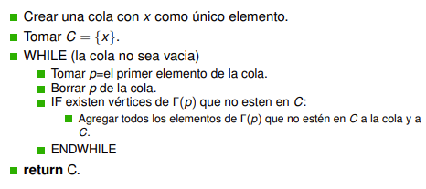

# Generalidades de Grafos (Repaso)

## Definición de grafo no dirigido
Un grafo no dirigido es un par ordenado $G=(V,E)$ donde $E\subseteq\lbrace A\subseteq V:|A|=2\rbrace$
  - Los elementos de $V$ se llaman _vértices_ o _nodos_.
    - La cantidad de elementos de $V$, salvo que se diga otra cosa, se denotará por defecto como $n \Rightarrow$ Supondremos $V$ como conjunto finito
  - Los elementos de $E$ se llaman _lados_ o _aristas_
    - La cantidad de elementos de $E$, salvo que se diga otra cosa, se denotará por defecto como $m$
    - Un elemento $\lbrace x,y\rbrace\in E$ será abreviado como $xy$
      - $x$, $y$ se llamarán los extremos del lado $xy$
      - $xy$ = $yx$

## Definición de grafo dirigido

Un grafo dirigido es un par $G=(V,E)$ donde $V$ es un conjunto cualquiera (finito para nosotros) y $E\subseteq V\times V$
  - Ahora los lados son pares ordenados en vez de conjuntos
    - Luego, $(x,y)\neq (y,x)$
  - Denotaremos el lado $(x,y)$ como $\overrightarrow{xy}$

## Definición de subgrafo
Dado un grafo $G=(V,E)$, un subgrafo de $G$ es un grafo $H=(W,F)$ tal que $W\subseteq V$ y $F\subseteq E$
  - No cualquier par $(W,F)$ con $W\subseteq V$ y $F\subset E$ será un subgrafo porque pedimos que $H$ sea un grafo ($\Rightarrow$ si un lado está, entonces los extremos también)

## Definición de vecinos

### Caso no dirigido

Dado $x\in V$, los vértices que forman un lado con $x$ se llaman _los vecinos de_ $x$
  - El conjunto de vecinos de $x$ se denota por $\Gamma(x)$
    - $\Gamma(x)=\lbrace y\in V:xy\in E\rbrace$

### Caso dirigido

Dado $x\in V$, los vértices que forman un lado con $x$ se llaman _los vecinos de_ $x$ y se diferencian en:
  - _Vecinos hacia adelante_: $\Gamma^+(x)=\lbrace y\in V:\overrightarrow{xy}\in E$
  - _Vecinos hacia atrás_: $\Gamma^-(x)=\lbrace y\in V:\overleftarrow{xy}\in E$

## Definición de grado
### Grado de un vértice

El grado del vértice $x$ es igual a su cantidad de vecinos $\Rightarrow d(x)=|\Gamma(x)|$

### Grado de un grafo

El menor de todos los grados de un grafo lo denotaremos por $\delta$ y al mayor de todos por $\Delta$. Es decir:
$$\delta=Min\lbrace d(x):x\in V\rbrace$$
$$\Delta=Max\lbrace d(x):x\in V\rbrace$$

Un grafo que tenga $\delta=\Delta$ se llama _grafo regular_ o $\Delta$ _-regular_

## Tipos de grafos
### Cíclicos

El grafo cíclico de $n$ vértices ($n>3$) denotado por $C_n$ es el grafo con:
  - $V=\lbrace 1,..,n\rbrace$
  - $E=\lbrace 12,23,..,(n-1)n,n1\rbrace$
Luego, algunas propiedades son:
  - $n$ lados
  - $\forall x\in V, d_{C_n}(x)=2\Rightarrow$ Es un grafo regular

### Completos

El grafo completo de $n$ vértices denotado por $K_n$ es el grafo con:
  - $V=\lbrace 1,..,n\rbrace$
  - $E=\lbrace ij:i,j\in V, i\lt j\rbrace$
Luego, algunas propiedades son:
  - $\frac{n(n-1)}{2}$ lados
  - $\forall x\in V, d_{K_n}(x)=n-1\Rightarrow$ Es un grafo regular

## Componentes conexas
### Definiciones

Un camino entre 2 vértices $x,y$ es una sucesión de vértices $x_1,..,x_r$ tales que:
  - $x_1=x$
  - $x_r=y$
  - $x_ix_{i+1}\in E\forall i\in\lbrace 1,..,r-1\rbrace$
La relación $x\sim y \Leftrightarrow\exists$ camino entre $x,y$ es una relación de equivalencia. Cada partición del grafo $G$ en clases de equivalencia son _componentes conexas_ de $G$

Un grafo se dice _conexo_ si tiene una sola componente conexa

### Determinación de componentes conexas

Dado un $x$, decimos que $DFS(x)$ y $BFS(x)$ son algoritmos que encuentran todos los vértices de la componente conexa de $x$.
Luego, para encontrar todas las componentes conexas, debemos hacer:
  - Tomar $W=\empty ,i=1$
  - Tomar un vértice cualquiera $x\in V:x\not\in W$
  - Correr $DFS(x)$ o $BFS(x)$
  - Llamarle $C_i$ a la componente conexa encontrada
  - $W=W\cup\lbrace v\in C_i\rbrace$
  - Si $W=V$, return $C_1,..,C_i$. Sino:
    - $i=i+1$
    - Seguir desde el paso $2$

#### BFS

Su complejidad es $O(m)$

#### DFS

Su complejidad es $O(m)$